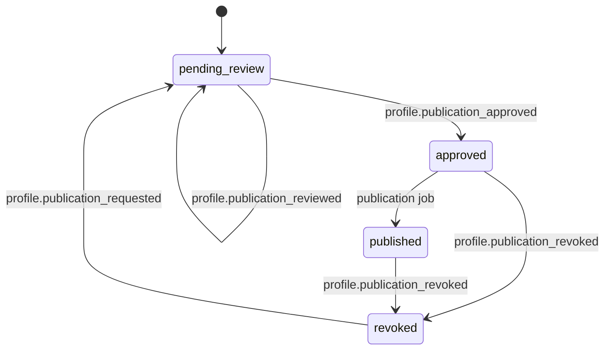

# Public Content Policy

## Purpose

Phase 8 public storytelling must preserve privacy before visibility. Public routes may render only public-safe profile or story records that have explicit member consent, admin approval, and good standing where the story represents a living member profile.

## Visibility Contract

Public profile and public-safe storytelling query builders must enforce:

```sql
where visibility = 'public'
  and standing = 'good'
  and approved = true
```

Consent is a required domain input for the same decision. If consent is missing or revoked, the record must resolve to private visibility even when an older row still says `visibility='public'`.

## Query Guardrails

| Guardrail | Requirement |
| --- | --- |
| Predicate pushdown | Repository methods must include standing, visibility, consent, and approval predicates before rows leave the data layer. |
| Public projection | Public reads may project display name, biography, and public freshness metadata only. |
| No broad selection | `SELECT *` is prohibited for public profile/story queries. |
| No internal provenance fields | Member account IDs, raw contact fields, audit metadata, standing history details, and workflow state stay off public payloads. |

## CDN Readiness And Cache Isolation

Public endpoints must be cacheable only when they are anonymous, read-only, and backed by public-safe repository projections.

| Header | Required Value |
| --- | --- |
| `Cache-Control` | `public, max-age=300, s-maxage=3600, stale-while-revalidate=60` |
| `Vary` | `Accept-Encoding` |
| `X-Surface` | `public` |

Cache keys are derived from URL path plus query parameters only. Public handlers must ignore `Authorization` and session cookies, must not emit `Set-Cookie`, and must not include internal IDs, consent state, standing state, or approval workflow state in public payloads.

Public server-rendered views use the same projection allowlist as the public API: `displayName`, `biography`, and `updatedAt`. Templates must not place internal IDs, consent timestamps, review notes, standing state, workflow state, or private identifiers in HTML comments, hidden `data-*` attributes, meta tags, or structured data.

## Standing Rules

- `good`: eligible for public rendering only after explicit public visibility, consent, and admin approval.
- `review`: private by default and omitted from public feeds.
- `blocked`: private and not approval-eligible.

Honorary and memorial workflows may have distinct standing inputs where no living member account exists, but they still require approval, publication state, and admin stewardship before any public render.

## Audit Rules

- Member consent or visibility changes emit `CONSENT_VISIBILITY_CHANGED`.
- Admin approval emits `PUBLIC_PROFILE_APPROVED`.
- Standing changes that alter public eligibility emit `STANDING_VISIBILITY_CHANGED` when Phase 8 persistence is wired.
- Public content request and approval workflows emit `profile.publication_requested`, `profile.publication_reviewed`, `profile.publication_approved`, and `profile.publication_revoked`.

## Approval Workflow



Approval requires `admin` or `chief_admin`, admin surface policy, audit trail, and a same-request member standing re-check of `good`.

Honorary and memorial content requires dual approval. An `admin` or `chief_admin` may complete the first approval, but only `chief_admin` may complete final approval and emit `profile.honorary_published` or `profile.memorial_published`.

## Queue Persistence Rules

Approval queue state lives in `public_approval_record`. Review notes must be sanitized before persistence by stripping markup, truncating to the safe length limit, and redacting email and phone-like values. Duplicate approval attempts return the existing approved record rather than creating a second approval chain.

Queue endpoints support status filters for `pending_review`, `approved`, `published`, and `revoked`. Queue responses exclude sanitized review notes and internal workflow commentary; failures return generic safe error codes such as `standing_changed`, `policy_denied`, or `invalid_transition`.
